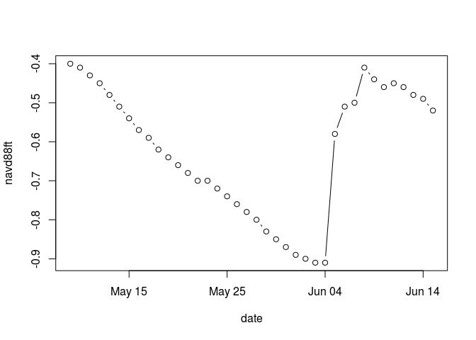

<!-- README.md is generated from README.Rmd. Please edit that file -->
edenR
=====

[](http://www.repostatus.org/#concept)

The goal of edenR is to provide an `R` interface to the [Everglades Depth Estimation Network](https://sofia.usgs.gov/eden/).

Installation
------------

You can install edenR from github with:

``` r
# install.packages("devtools")
devtools::install_github("jsta/edenR")
```

Usage
-----

``` r
library(edenR)
```

Pull stage data

``` r
dt <- getstage(sites = "NMP", start = "2015-05-07", end = "2015-06-15")
#> No encoding supplied: defaulting to UTF-8.
plot(dt[,1:2], type = "b")
```



compare with the [equivalent webpage](http://sofia.usgs.gov/eden/eve/index.php?timeseries_start=2015-05-07&timeseries_end=2015-06-16&site_list%5B%5D=NMP&water_level=stage&day_hour=daily&max=5&dry=dry&hydrograph_query=Update+Selection).
